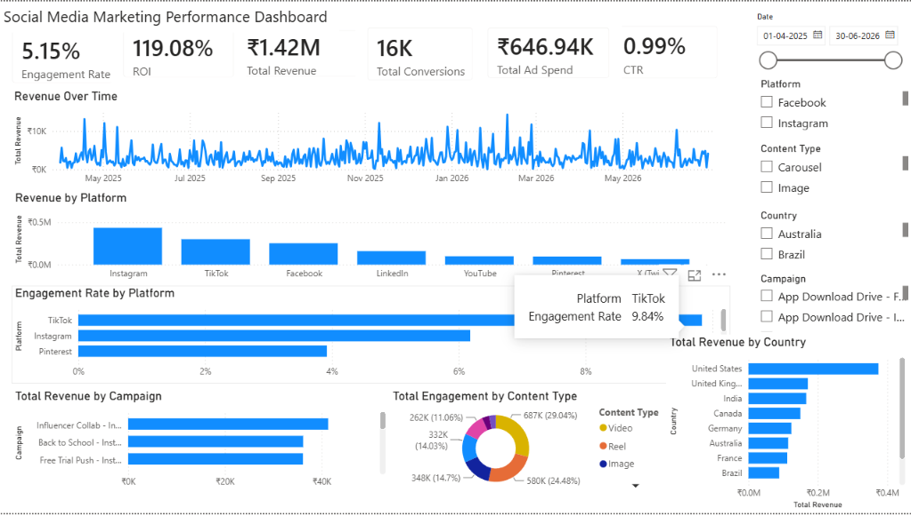
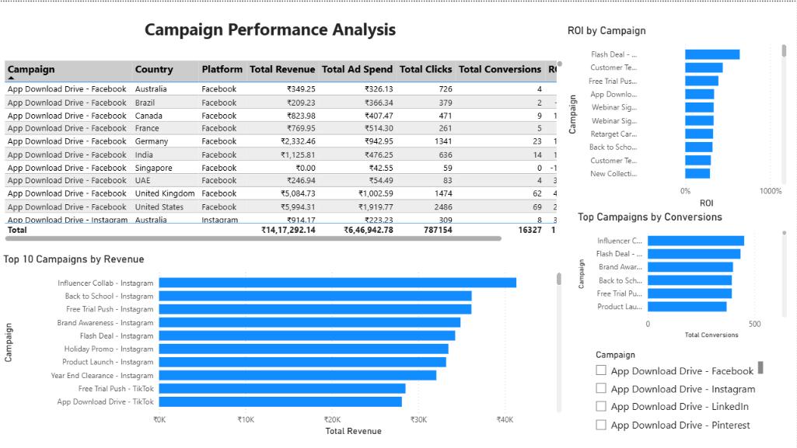
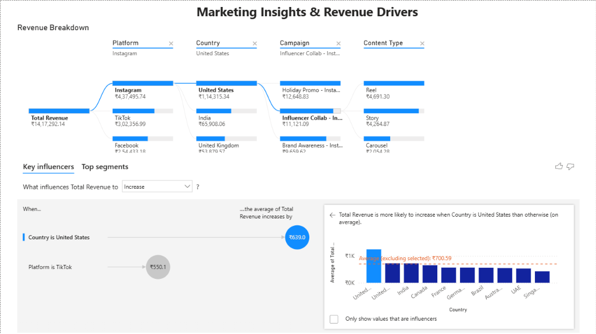

# social-media-marketing-dashboard
Power BI dashboard analyzing social media marketing campaigns using DAX and interactive visualizations.
# Social Media Marketing Dashboard | Power BI

# Overview

This project is an interactive Power BI dashboard developed to analyze social media marketing campaign performance. It provides insights into revenue, campaign effectiveness, engagement, conversions, CTR, and ROI through interactive visualizations and DAX measures.

---

# Project Objectives

- Monitor overall marketing performance
- Evaluate campaign effectiveness
- Compare performance across social media platforms
- Analyze ROI and conversion metrics
- Identify key revenue drivers using AI visuals

---

# Tools & Technologies

- Power BI Desktop
- Power Query
- DAX (Data Analysis Expressions)
- Microsoft Excel

---

# Dashboard Pages

# Executive Dashboard

- KPI Cards
  - Total Revenue
  - Total Ad Spend
  - ROI
  - CTR
  - Engagement Rate
  - Total Conversions
- Revenue Over Time
- Revenue by Platform
- Engagement Rate by Platform
- Revenue by Country
- Engagement by Content Type
- Interactive Slicers

# Campaign Performance

- Campaign Performance Table
- Top 10 Campaigns by Revenue
- ROI by Campaign
- Top Campaigns by Conversions
- Campaign Filter

# Marketing Insights

- Decomposition Tree
- Key Influencers Analysis
- Interactive Revenue Breakdown

---

# Key DAX Measures

- Total Revenue
- Total Ad Spend
- ROI
- CTR
- Engagement Rate
- Total Conversions

---

# Dashboard Preview

# Executive Dashboard



# Campaign Performance



# Marketing Insights



---

# Business Insights

- Instagram generated the highest overall revenue.
- Revenue varies significantly across campaigns and countries.
- ROI differs considerably between campaigns, highlighting opportunities for optimization.
- Key Influencers analysis identifies factors that contribute most to revenue growth.
- Interactive filters enable detailed performance analysis across multiple dimensions.

---

# Repository Contents

```
📁 Social-Media-Marketing-Dashboard
│
├── Social Media Dashboard.pbix
├── marketing_dataset.xlsx
├── README.md
└── screenshots
    ├── page1.png
    ├── page2.png
    └── page3.png
```

---

# Skills Demonstrated

- Data Cleaning
- Data Modeling
- DAX Calculations
- KPI Development
- Interactive Dashboard Design
- Business Intelligence
- Data Visualization
- Marketing Analytics

---

Author

Kaviya
